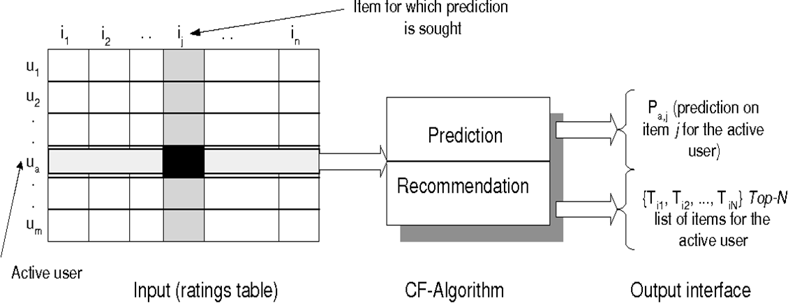
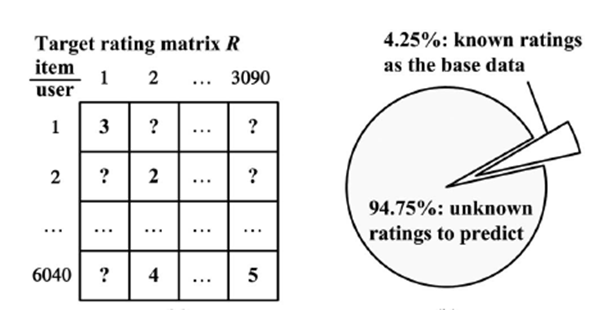
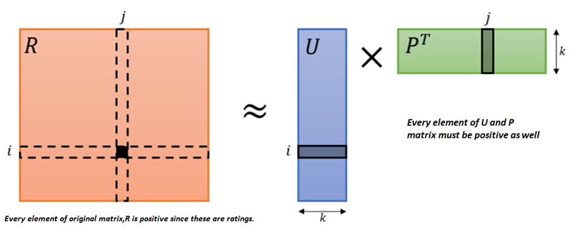
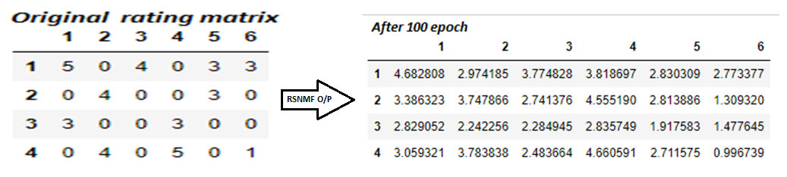
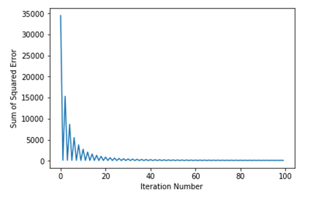

# Recommender-System
With the growth of Internet usage data has growth massively. So it has become very difficult to filter out the looked-for information from billions of trillions of data. Hence the role of recommender system came into existence. It solves the problem of information overload and assists people according to their preferences. For example, Amazon uses it to recommend products to their customers; YouTube uses it to decide which video to play next in auto play. There have been done so many researches to address these problems. Several models have been proposed. Almost all of them could be categorized into following two
- Collaborative Filtering
- Content-based Filtering.

In case of Collaborative Filtering we look at the previous or historical data to guess the individual user preference for the items i.e. discovering the underlying rating patterns of a user to an item.

But in case of Content-based Filtering we look at the meta data of the item to do the job. For example, if we consider movies to be recommended and we approach content-based Filtering, we will consider the meta data meaning Movie Genre, Movie Casts, Director etc. On the other hand, we need only the ratings by different users in case of collaborative filtering.
Collaborative-Filtering has certain advantages over Content-based Filtering such as we need not to know item metadata which does not necessarily explain the whole story and we could sidestep cold-star problem as well. CF methods are proved to be effective among existing recommender systems. This types of models are made on user-item usage history. A user-item feedback matrix (i.e. utility matrix) is required for it. Suppose the ratings of movies given by users in Netflix.[1] The higher the rating is the more likely the movie will be the preferences of the users. But users can access a finite item set. So each user will miss to rate so many items intentionally or unintentionally. Hence the data we need becomes very much sparse.

## Collaborative Filtering
There are so many approaches for this category but the most popular one is Non-Negative Matrix Factorization. The outline is as following:

## Regularized Single Element based Non-Negative Matrix Factorization (RSNMF)
This is one of the advanced versions of NMF. It came into picture in 2014. Below is the demo with dummy utility matrix.

